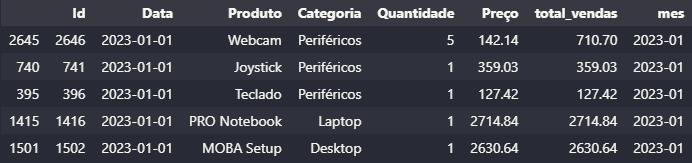
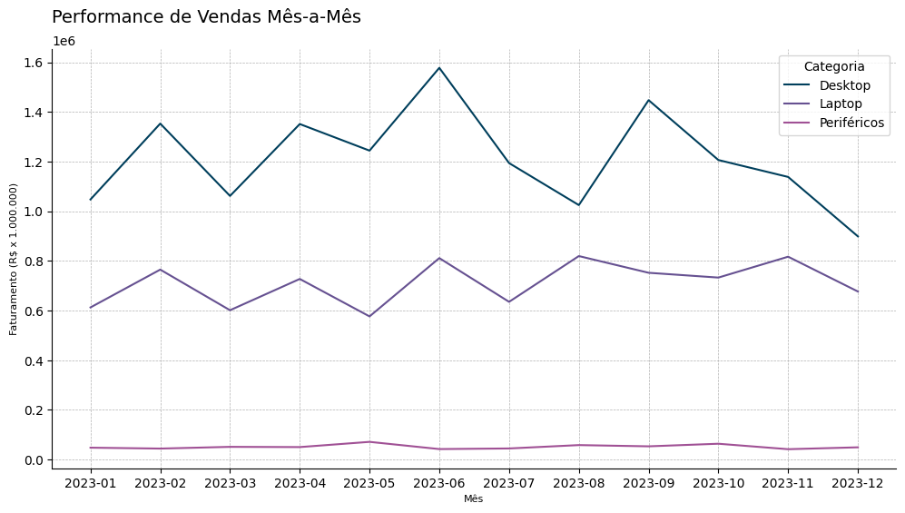
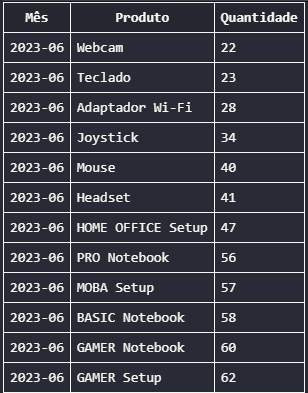

# Explicações e detalhes
## Parte 1 - Programação em R ou Python

Minha escolha de linguagem foi o Python, é a que tenho maior prática em projetos e análises estatísticas. 

### 1.1. Limpeza e Análise de Dados de Vendas

Essas foram as bibliotecas que utilizei na criação do script. Em projetos anteriores já utilizei a biblioteca Faker para criação de dados sintéticos, neste projeto escolhi criar um arquivo ``.db `` para realizar as queries da Parte 2 de forma direta no VSCode. 

```Python
import pandas as pd
import numpy as np
from faker import Faker
from datetime import datetime
import random
from tqdm import tqdm
import sqlite3

```

Configurei seeds no Faker e random por questões de reprodutibilidade. 

```Python
fake = Faker('pt_BR')
Faker.seed(42)
random.seed(42)
```
Os dados de venda foram sobre uma loja de informática, então pensei em linhas diferentes de laptops e desktop, além de periféricos. Nesse dicionário defini os produtos, categorias e faixas de preço.

```Python
cat_produtos = {
    'Periféricos': [
        ('Mouse', (10, 200)),
        ('Teclado', (25, 800)),
        ('Headset', (50, 500)),
        ('Webcam', (50, 280)),
        ('Joystick', (120, 500)),
        ('Adaptador Wi-Fi', (80, 100))
    ],
    'Desktop': [
        ('MOBA Setup', (2000, 10000)),
        ('HOME OFFICE Setup', (1500, 3000)),
        ('GAMER Setup', (4000, 30000))
    ],
    'Laptop': [
        ('BASIC Notebook', (1800, 2500)),
        ('PRO Notebook', (2500, 4000)),
        ('GAMER Notebook', (4000, 12000))
    ]
}
```

Então iniciei a criação do script para geração dos dados, primeiro criando a função `generate_dataset` que irá pegar os itens do dicionário acima e gerar aleatoreamento registros de transações a partir da entrada de ``n_entries`` (número de registros), ``start_date`` (data de início) e `end_date` (data fim) para gerar um DataFrame.

```Python
def generate_dataset(n_entries: int, start_date: str, end_date: str) -> pd.DataFrame:
    """
    Gera um DataFrame com dados fictícios baseado no dicionário contendo os Produtos, Categoria e faixas de preço (definido acima).

    Parâmetros:
        n_entries (int): número de registros que serão gerados.
        start_date (str): data de início dos registros no formato 'YYYY-MM-DD' 
        end_date (str): data de fim dos registros no formato 'YYYY-MM-DD' 

    Retorna:
        pd.DataFrame: Um DataFrame contendo as seguintes colunas:
            - 'Id': Identificador único da transação.
            - 'Data': Data da transação.
            - 'Produto': Nome do produto.
            - 'Categoria': Categoria do produto.
            - 'Quantidade': Quantidade vendida na transação.
            - 'Preço': Preço do produto.
    """
    
    # Converte as strings de data para o tipo datetime
    start_date = datetime.strptime(start_date, '%Y-%m-%d')
    end_date = datetime.strptime(end_date, '%Y-%m-%d')

    # Lista vazia par armazenar os dados
    dados = []

    # Loop de geração dos dados baseado no n_entries
    for id in tqdm(range(1, n_entries + 1), desc = "Gerando o dataset", unit = "registro"):
        data = fake.date_between(start_date, end_date)

        # Seleção da categoria e produto
        categoria = random.choice(list(cat_produtos.keys()))
        produto, faixa_preco = random.choice(cat_produtos[categoria])

        # Seleção da Quantidade em cada transação (com probabilidades definidas)
        if categoria in ['Desktop', 'Laptop']:
            quantidade = np.random.choice([1, 1, 1, 2, 3], p = [0.9, 0.025, 0.025, 0.025, 0.025])
        else:
            quantidade = np.random.choice([1, 2, 3, 4, 5], p = [0.7, 0.075, 0.075, 0.075, 0.075])

        # Seleção do preço no tipo float, determinado dentro da faixa de preço
        preco = round(random.uniform(faixa_preco[0], faixa_preco[1]), 2)

        # Adiciona cada registro à lista vazia
        dados.append({
            'Id': id,
            'Data': data,
            'Produto': produto,
            'Categoria': categoria,
            'Quantidade': quantidade,
            'Preço': preco
        })

    # Criação do DataFrame com os registros gerados
    df = pd.DataFrame(dados)
    return df
```
Com o DataFrame gerado, agora vem o bloco de código para execução do script. Para manter o script reutilizável, tornei os inputs para criação do DataFrame selecionavéis pelo usuário invés de um script automático. 

```Python
if __name__ == "__main__":
    """
    Bloco de execução do script, solicita os parâmetros ao usuário, 
    gera os dados e salva em banco de dados SQLite (arquivo de extensão .db)
    """
    n_entries = int(input((f"Insira o número de registros: ")))
    start_date = str(input((f"Insira a data inicial no formato YYYY-MM-DD: ")))
    end_date = str(input((f"Insira a data inicial no formato YYYY-MM-DD: ")))
    # Caminho do arquivo de banco de dados
    db_file = 'data/database.db' 

    # Geração do DataFrame
    df = generate_dataset(n_entries, start_date, end_date)

    # Salvando o DataFrame em banco de dados SQLite
    with sqlite3.connect(db_file) as conn:
        df.to_sql("vendas", conn, if_exists="replace", index = False)
        print(f"Arquivo .db com {n_entries} registros salvo na pasta 'data/'")
```
Os processos necessários de limpeza e manipulação se encontram no Jupyter Notebook da [EDA](../notebook/EDA.ipynb). 

##### Calcule o total de vendas (Quantidade * Preço) por produto.

Primeiro foram criadas colunas de mês e total de vendas.

```Python
df["total_vendas"] = df["Quantidade"] * df["Preço"]
df["mes"] = df["Data"].dt.strftime("%Y-%m")
```


##### Identifique o produto com o maior número de vendas totais.
E então isso foi calculado através de um Group By. 

```Python
produtos = df.groupby("Produto").agg(unidades = ("Quantidade", "sum"), faturamento = ("total_vendas", "sum")).reset_index()
produtos
```


O produto com maior total de vendas foi o **GAMER Desktop**, com R$ 9.687.528,57.

##### Crie um gráfico de linha mostrando a tendência de vendas ao longo do tempo, analisando os dados mensalmente.




##### Identifique e descreva pelo menos dois padrões ou insights interessantes que você observou nos dados.

- Existe uma tendência de alta queda no faturamento no mês de dezembro.
- As vendas apresentam uma menor performance em relação ao faturamento após o segundo semestre. 
- Periféricos são o maior volume de venda, mas representam o menor faturamento da INFORMAX. 
- Junho foi o mês de maior faturamento.

## Parte 2 - SQL
Com base nas tabelas geradas no exercício anterior, escreva consultas SQL para:

##### Listar o nome do produto, categoria e a soma total de vendas (Quantidade * Preço) para cada produto. Ordene o resultado pelo valor total de vendas em ordem decrescente.

Recentemente comecei a usar *leading comma*, considero que melhora a legibilidade. Nesta query a lógica foi a seguinte: 

- Da tabela vendas, selecione as colunas Produto, Categoria, e a soma do cálculo de Quantidade * Coluna como Total de Vendas. Agrupe os resultados por Produto, e ordene pela coluna 3 (Total de Vendas) de forma decrescente.

```SQL
SELECT 
    v.Produto
    , v.Categoria
    , SUM(v.Quantidade * v.Preço) AS 'Total de Vendas' 
FROM vendas v
GROUP BY v.Produto 
ORDER BY 3 DESC;
``` 


##### Identificar os produtos que venderam menos no mês de junho de 2024.
Como os dados foram socilitados entre janeiro e dezembro de 2023, considerei que fossem dados de 2023. A lógica para a query foi a seguinte:

- Da tabela vendas, selecione '2023-06' como Mês, Produto, e a soma da coluna Quantidade como Quantidade. Agrupe os resultados por Produto, e ordene pela coluna 3 (Quantidade) de forma ascendente.

```SQL
SELECT
    '2023-06' AS 'Mês' 
    , v.Produto
    , SUM(v.Quantidade) AS 'Quantidade' 
FROM vendas v
WHERE v.Data BETWEEN '2023-06-01' AND '2023-06-30' 
GROUP BY v.Produto 
ORDER BY 3 ASC; 
```



## Parte 3 - Interpretação de Resultados
Com base nas análises realizadas nas Partes 1 e 2, escreva um breve relatório (máximo de 300 palavras) resumindo os principais insights encontrados e sugerindo possíveis ações baseadas nesses insights.

- Os resultados podem ser encontrados neste [arquivo](relatorio_insights.md).