# Teste de Estágio em Analytics QUOD


#### Índice
- [Introdução](#-introdução)
- [Ferramentas](#️-ferramentas)
- [Dataset](#-dataset)
- [Resultados](#-resultados)
- [Como usar](#️-como-usar)


## 📝 Introdução
Este projeto faz parte do teste proposto pela equipe de Recuros Humanos da QUOD para o estágio em Analytics. Ele consiste em:

### Parte 1 - Python
1. Criar um dataset com pelo menos 50 registros, contendo as colunas - Id, Data, Produto, Categoria, Preço.
    1.1. Realização limpeza e manipulações necessárias nos dados;
   
    1.2. Calcular o total de vendas (Quantidade * Preço);
   
    1.3. Identificar o produto com maior total de vendas;
### Parte 2 - SQL
2. Com o mesmo dataset escrever consultas para:

    2.1. Listar o nome do produto, categoria e a soma total de vendas (Quantidade * Preço) para cada produto. Ordene o resultado pelo valor total de vendas em ordem decrescente.
   
    2.2. Identificar os produtos que venderam menos no mês de junho de 2024.

### Parte 3 - Interpretação de Resultados
3. Com base nas análises realizadas nas Partes 1 e 2, escreva um breve relatório (máximo de 300 palavras) resumindo os principais insights encontrados e sugerindo possíveis ações baseadas nesses insights.

## 🛠️ Ferramentas
- **Python 3.12+**
    - **Bibliotecas**: Pandas, NumPy, Faker, Matplotlib, Seaborn, openpyxl, tqdm,  sqlalchemy, Notebook, Jupyter.

## 📊 Dataset 

|Coluna|Descrição|
|---|---|
|``Id``|Identificador único da transação|
|``Data``|Data da transação|
|``Produto``|Nome do produto|
|``Categoria``|Categoria do produto|
|``Quantidade``|Quantidade vendida na transação|
|``Preço``|Preço do produto|

O script para criação dos dados se encontra na pasta ``scr``. 

## ✅ Resultados

### Análise Exploratória de Dados
#### Estatísticas descritivas
- Em relação o Preço (e por consequência o Total de Vendas) uma média maior que a mediana indica uma assimétria à direita.
- Já quanto a Quantidade de produtos comprados em cada transação, em 87,84% foi de apenas um produto. 

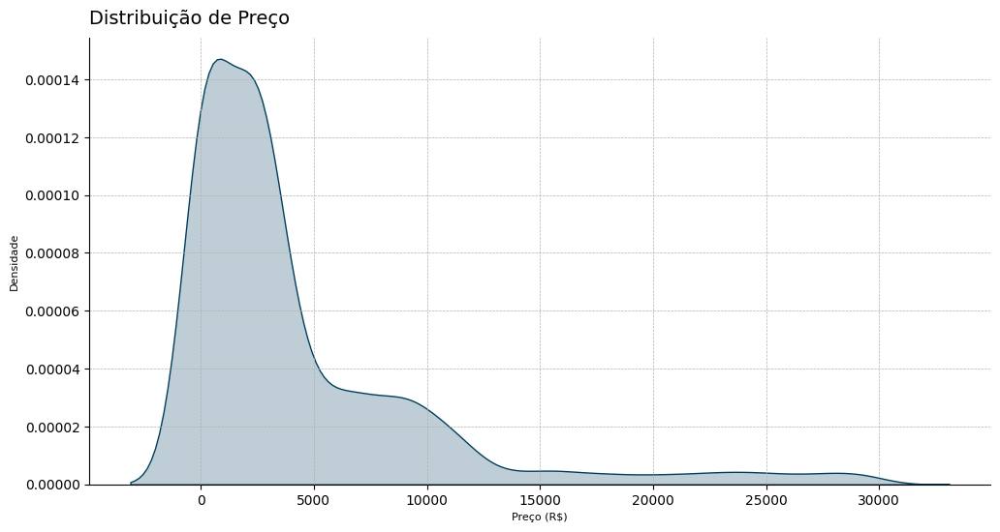

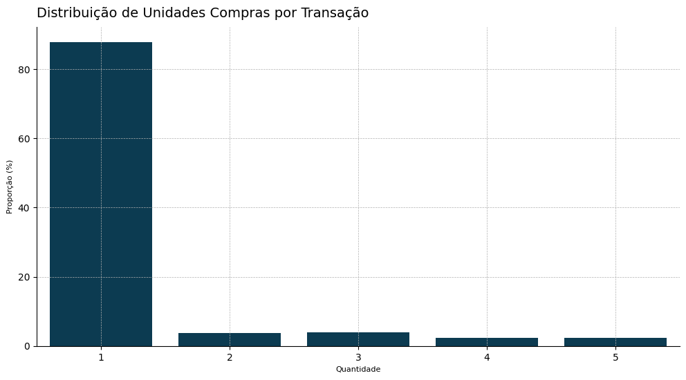

- O produto com a maior frequência de transações é o **BASIC Notebook**, e em relação a categoria foi a de **Laptops**.
- Setembro foi o mês com o maior número de transações. 

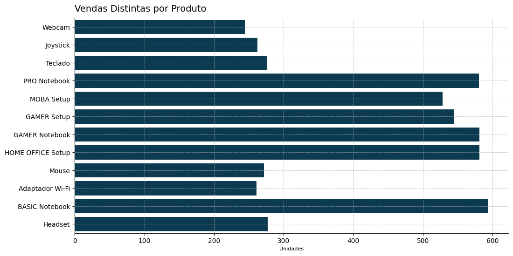

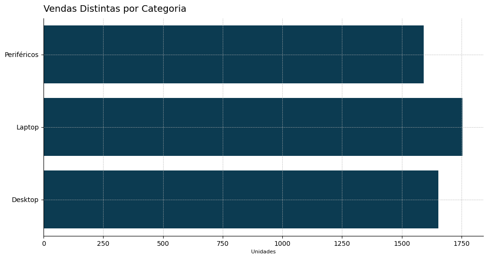

#### Explorando as features
##### Categoria x Faturamento & Volume de Vendas
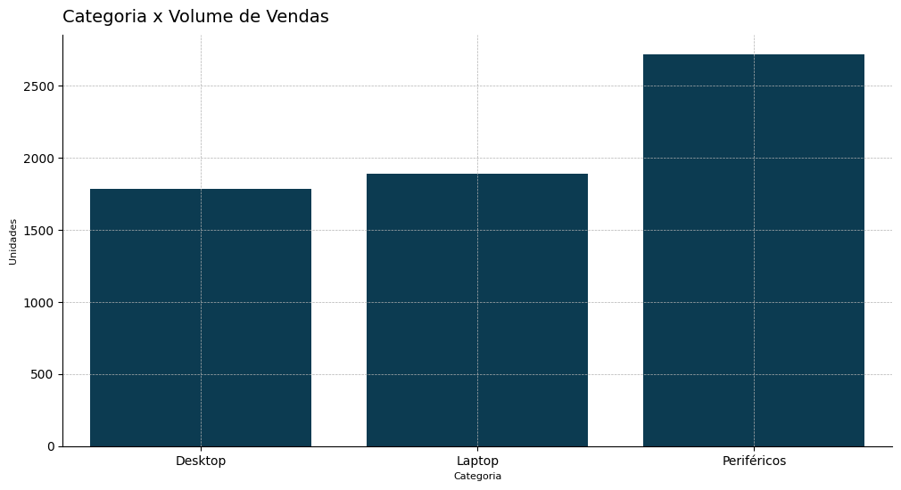


Apesar do alto volume de vendas, os periféricos são os que deixam menor faturamento para a loja sendo a categoria de Desktop a com maior valor agregado e aquela que gera maior faturamento.

##### Produtos x Faturamento & Volume de Vendas
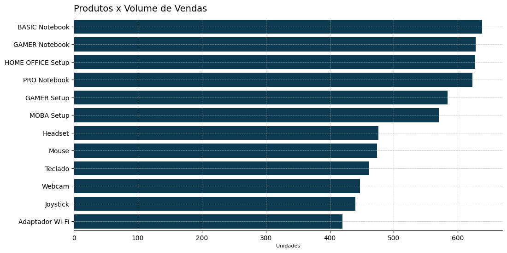

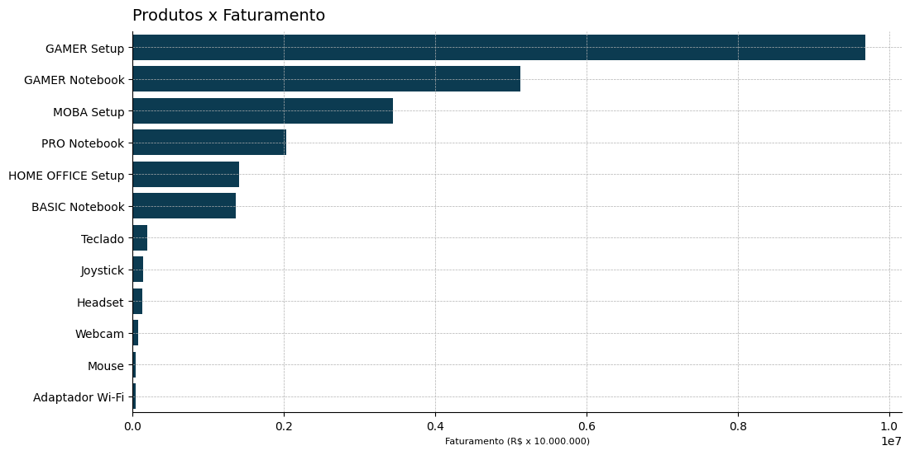

- A linha de produtos mais rentável é a **GAMER** tanto para Laptops quanto para Desktops, apesar da maior quantidade de unidades vendidas o Laptop **BASIC Notebook** é apenas o 6º em faturamento.
- O **GAMER Setup** é o produto com maior faturamento (Total de Vendas), R$ 9.687.528,57.

##### O desempenho no período analisando

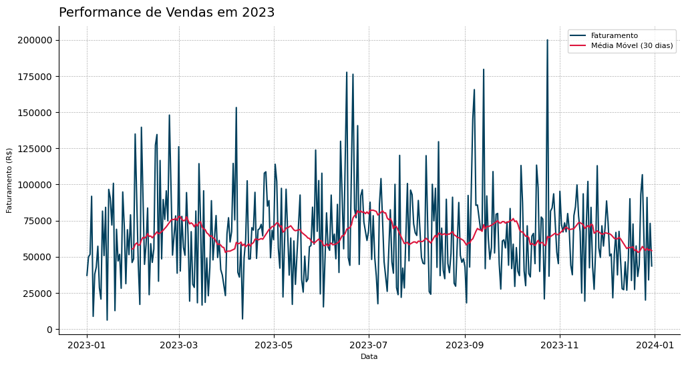

Observando a média móvel, o faturamento apresenta uma tendência de queda. Vamos analisar de forma mensal, para ter uma curva mais suave, além de observar também as tendências por cada Categoria de Produto.

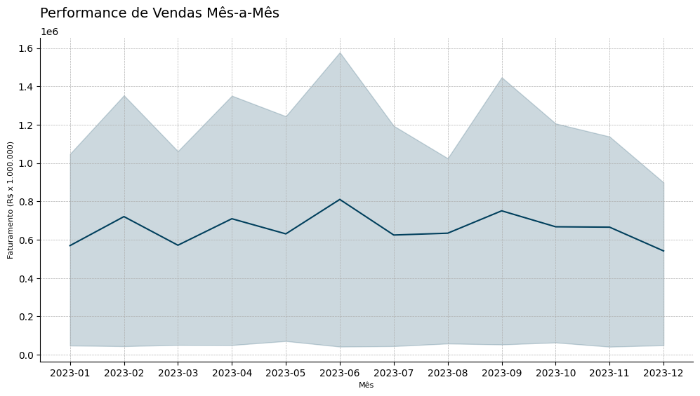

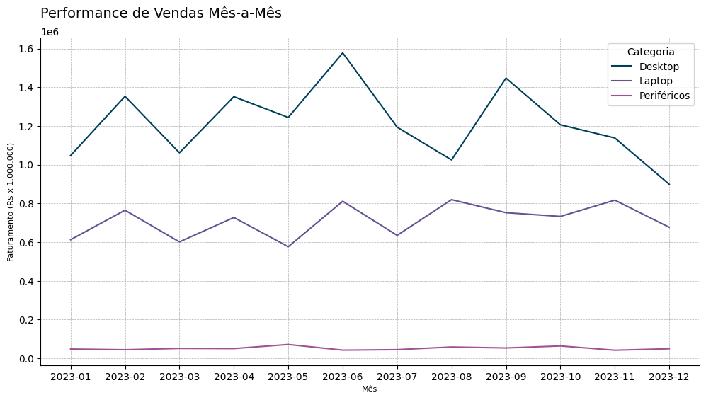

Existe uma tendência de forte queda nas vendas, analisando mais detalhadamente por Categoria, a partir do segundo semestre a queda se acentuou. 

##### 3.3. Conclusões

- Analisando a performance de venas do ano de 2023 podemos observar que a linha **GAMER** é a que tem maior retorno financeiro tanto para laptops e desktops dentro da Informax. 
- Periféricos representam a maior quantidade de produtos vendidos, o que pode trazer potenciais clientes para compra de *hardware* com maior valor agregado.
- A tendência de queda nas vendas no segundo semestre, especial no mês de dezembro, precisa ser revertida e investigada de forma mais profunda. Novembro é mês da agora tradicional *Black Friday*, é um momento do ano ideal para promoções mais agressivas que podem levantar o faturamento, além de também poder ser adotada uma estratégia de descontos em uma margem menor mas extendendo até o mês de dezembro (que foi o que apresentou maior queda) para promoções especiais de Natal.

### Consultas SQL

```SQL
-- Pergunta 1
SELECT 
    v.Produto
    , v.Categoria
    , SUM(v.Quantidade * v.Preço) AS 'Total de Vendas' -- Calculo do total de vendas
FROM vendas v
GROUP BY v.Produto -- Agrupamento por Produto
ORDER BY 3 DESC; -- Ordenamento por Total de Vendas decrescente
```
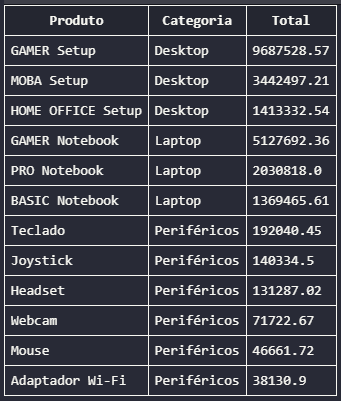

```SQL
-- Pergunta 2
/* Obs. Como na geração dos dados foram 
solicitados dados do ano de 2023
estou considerando Jun/2023 e não 2024 como no e-mail */

SELECT
    '2023-06' AS 'Mês' -- Flag do mês
    , v.Produto
    , SUM(v.Quantidade) AS 'Quantidade' -- Calculo da quantidade vendida
FROM vendas v
WHERE v.Data BETWEEN '2023-06-01' AND '2023-06-30' -- Filtro de vendas no período
GROUP BY v.Produto -- Agrupamento por Produto
ORDER BY 3 ASC; -- Odernamento do menor para o maior
```
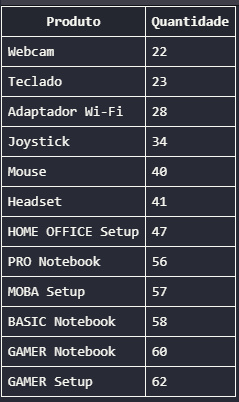

## ⚙️ Como usar
#### Estrutura do projeto
```plaintext
.
├── data/                  
│   ├── database.db                 # Banco de dados  
│   └── processed/                  # Dados que passaram por processamento
│       └── data_clean.csv          # Dataset da Parte 1
│
├── doc/                            # Documentos e imagens
│   ├── consultas_sql.sql           # Consultas da Parte 2 
│   ├── relatorio_insights.md       # Relatório da Parte 3
|   ├── explicacoes.md              # Explicações sobre o código
│   └── img/                        # Imagens geradas durante a análise
│
├── notebook/                       # Jupyter Notebook
│   ├── eda.ipynb                   # Análise da Parte 1
│   └── query.sql                   # Query para extração de dados
│
├── scr/                            # Scripts
│   └── generate_dataset.py         # Script Dados da Parte 1
│
├── poetry.lock                     
├── pyproject.toml          
├── readme.md               

```
#### Instalação
##### Instalação do poetry
```bash
pip install poetry
```
##### Clonar repositório
```bash
git clone https://github.com/datalopes1/Teste_Analytics_AndreLopes.git
cd Teste_Analytics_AndreLopes/
```
##### Instalação das dependências
```bash
poetry install
```
##### Ativação do ambiente virtual
```bash
poetry shell
```
##### Geração de um novo arquivo ``.db `` do SQLite
```bash
poetry run python scr/generate_dataset.py
```

## 📞 Contato
- LinkedIn: https://www.linkedin.com/in/andreluizls1
- Portfolio: https://sites.google.com/view/datalopes1
- E-mail: datalopes1@proton.me
